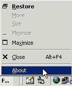



## Bobo Modifying the System menu \- easy

### Description

Adding items to the system menu can make your application look more professional. This is a very simple example of how to do it and be able to respond to clicks on that menu. No need to vote - this is in response to a question in the discussion forum.
 
### More Info
 

             |
---                |---
**Submitted On**   |2003-06-13 14:18:08
**By**             |[MrBobo](https://github.com/Planet-Source-Code/PSCIndex/blob/master/ByAuthor/mrbobo.md)
**Level**          |Beginner
**User Rating**    |5.0 (50 globes from 10 users)
**Compatibility**  |VB 6\.0
**Category**       |[VB function enhancement](https://github.com/Planet-Source-Code/PSCIndex/blob/master/ByCategory/vb-function-enhancement__1-25.md)
**World**          |[Visual Basic](https://github.com/Planet-Source-Code/PSCIndex/blob/master/ByWorld/visual-basic.md)
**Archive File**   |[Bobo\_Modif1600586132003\.zip](https://github.com/Planet-Source-Code/mrbobo-bobo-modifying-the-system-menu-easy__1-46157/archive/master.zip)

